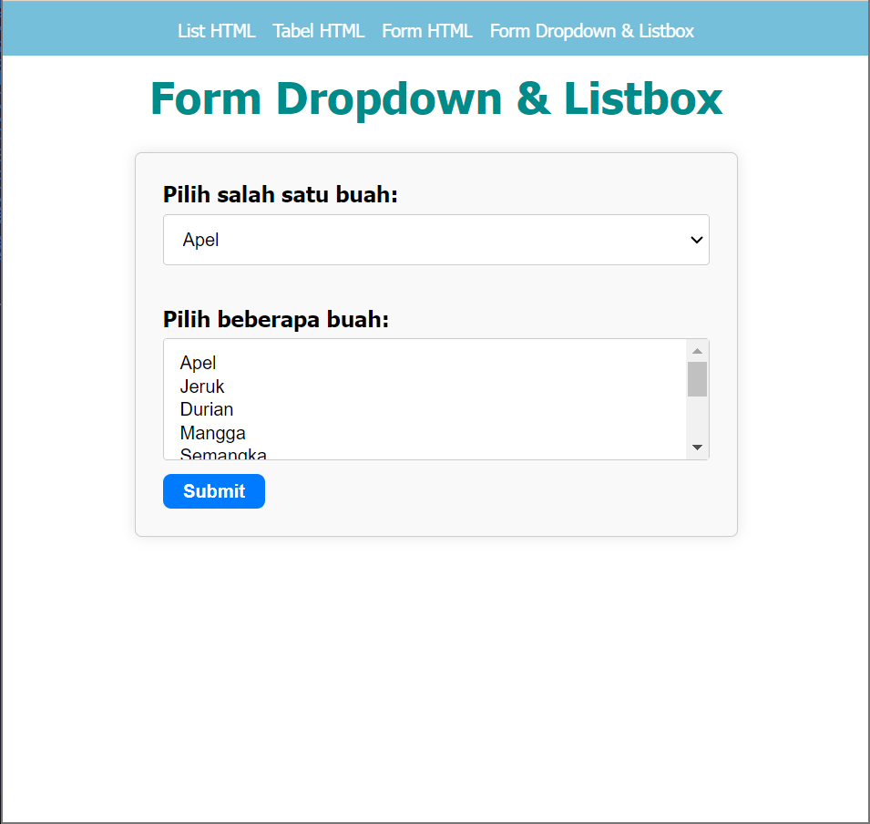

# Lab 3 Web

```
Nama    : Dipca Anugrah
NIM     : 312210666
Kelas   : TI.2.A.4
MATKUL  : Pemrograman Web 1
```

## **Daftar Isi**

**1. [Instruksi Praktikum](#instruksi-praktikum)**  
**2. [Langkah-langkah Praktikum](#langkah-langkah-praktikum)**  
**3. [Pertanyaan dan Tugas](#pertanyaan-dan-tugas)**

## **Instruksi Praktikum**

1. Persiapkan text editor misalnya VSCode.
2. Buat folder baru dengan nama Lab3Web
3. Ikuti langkah-langkah praktikum yang akan dijelaskan berikutnya.
4. Lakukan validasi dokumen html dengan mengakses http://validator.w3.org

## **Langkah-langkah Praktikum**

**1. Membuat Ordered List & Unordered List**

```html
<section id="order-list">
  <h2>Ordered List</h2>
  <ol>
    <li>Pemrograman Web</li>
    <li>Sistem Informasi</li>
    <li>Basis Data 2</li>
  </ol>
</section>
```

```html
<section id="unorder-list">
  <h2>Unordered List</h2>
  <ul type="square">
    <li>Jaringan Komputer</li>
    <li>Struktur Data</li>
    <li>Algoritma &amp; Pemrograman</li>
  </ul>
</section>
```

Terdapat pada file [here](lab3_list.html)

**2. Membuat Description List**

```html
<section id="unorder-list">
  <h2>Description List</h2>
  <dl>
    <dt>Fakultas Teknik</dt>
    <dd>Teknik Industri</dd>
    <dd>Teknik Informatika</dd>
    <dd>Teknik Lingkungan</dd>
    <dt>Fakultas Ekonomi dan Bisnis</dt>
    <dd>Akuntansi</dd>
    <dd>Manajemen</dd>
    <dd>Bisnis Digital</dd>
  </dl>
</section>
```

Terdapat pada file [here](lab3_list.html)

**3. Membuat Tabel**

```html
<table border="1" cellpadding="4" cellspacing="0">
  <thead>
    <tr>
      <th>No.</th>
      <th>Fakultas</th>
      <th>Program Studi</th>
    </tr>
  </thead>
  <tbody>
    <tr>
      <td>1.</td>
      <td>Teknik</td>
      <td>Teknik Informatika</td>
    </tr>
    <tr>
      <td>2.</td>
      <td>Teknik</td>
      <td>Teknik Industri</td>
    </tr>
    <tr>
      <td>3.</td>
      <td>Teknik</td>
      <td>Teknik Lingkungan</td>
    </tr>
  </tbody>
</table>
```

Terdapat pada file [here](lab3_tabel.html)

**4. Mengatur Margin dan Padding**

```html
<table border="1" cellpadding="4" cellspacing="0"></table>
```

Terdapat pada file [here](lab3_tabel.html)

**5. Menggabungkan Sel Data**

```html
<tr>
  <td>1.</td>
  <td rowspan="3">Teknik</td>
  <td>Teknik Informatika</td>
</tr>
```

Terdapat pada file [here](lab3_tabel.html)

**6. Membuat Form**

```html
<form action="proses.php" method="post">
  <fieldset>
    <legend>Data Pelanggan</legend>
    <p>
      <label for="nama">Nama</label>
      <input type="text" id="nama" name="nama" />
    </p>
    <p>
      <label for="alamat">Alamat</label>
      <textarea id="alamat" name="alamat" cols="20" rows="3"></textarea>
    </p>
    <p>
      <label>Jenis Kelamin</label>
      <input id="jk_l" type="radio" name="kelamin" value="L" /><label for="jk_l"
        >Laki-laki</label
      >
      <input id="jk_p" type="radio" name="kelamin" value="P" /><label
        qafor="jk_p"
        >Perempuan</label
      >
    </p>
    <p><input type="submit" value="Login" /></p>
  </fieldset>
</form>
```

Terdapat pada file [here](lab3_form.html)

**7. Menabahkan Style**

Style terdapat pada file [here](css/style.css)

## **Pertanyaan dan Tugas**

1. Buatlah form yang menampilkan **dropdown** menu dan **listbox**dengan _multiple selection_.

   ```html
    <form class="form_tugas">
        <label for="dropdown">Pilih salah satu buah:</label>
        <select name="dropdown" id="dropdown">
            <option value="apel">Apel</option>
            <option value="jeruk">Jeruk</option>
            <option value="durian">Durian</option>
            <option value="mangga">Mangga</option>
            <option value="semangak">Semangka</option>
        </select>

        <br><br>

        <label for="listbox">Pilih beberapa buah:</label>
        <select name="buah[]" multiple id="listbox">
            <option value="apel">Apel</option>
            <option value="jeruk">Jeruk</option>
            <option value="durian">Durian</option>
            <option value="mangga">Mangga</option>
            <option value="semangka">Semangka</option>
            <option value="kelapa">Kelapa</option>
            <option value="anggur">Anggur</option>
            <option value="melon">Melon</option>
            <option value="pepaya">Pepaya</option>
            <option value="nanas">Nanas</option>
        </select>

        <br>

        <input type="submit" value="Submit" id="input_tugas">
    </form>
     </fieldset>
   </form>
   ```

    <br>

   

<br>

**[kembali](#lab-3-web)**
